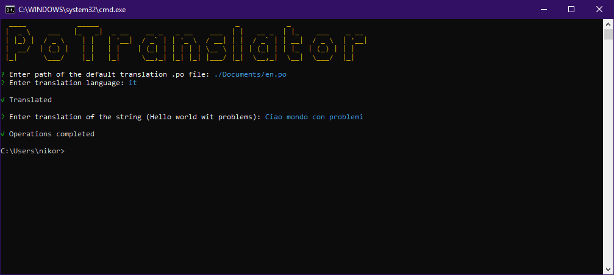

# PoTranslator
[](https://www.npmjs.com/package/potranslator)


[](https://www.ibm.com/watson/services/language-translator/)

PoTranslator is a CLI tool created to automatically translate .po/.pot files.

Functionality:
- Automatic translation
- Possibility to modify the translation if the automatic one is not precise
- Dozens of languages supported

PoTranslator uses *IBM Watson Language Translator* service to provide automatic translation.

[Check out here the available languages](https://cloud.ibm.com/docs/services/language-translator?topic=language-translator-translation-models)

## Install
### Install globally
``` console
$ npm install -g potranslator
```

## Usage
``` console
$ potranslator
```
You can also provide optional parameters:
``` console
$ potranslator -p <InputFile> -l <OutputLanguage>
```
- `<InputFile>` is the path of the .po/.pot file that PoTranslator will translate
- `<OutputLanguage>` is the ISO code of the target language that you want that your file will be translated to (See the link above for available languages). 

PoTranslator automatically detect the input language, if it is not possible, the tool will ask you for the ISO code of the input language, as you can see in the image below.  


## Examples

### Without options provided
``` console
$ potranslator
```

### With `<InputFile>` provided
``` console
$ potranslator -p ./Documents/en.po
```

### With `<InputFile>` and `<OutputLanguage>` provided (and output file existing yet)
``` console
$ potranslator -p ./Documents/en.po -l it
```


## Credits
Made with :heart: by [Nicolò Rebaioli](https://www.rebaioli.altervista.org)